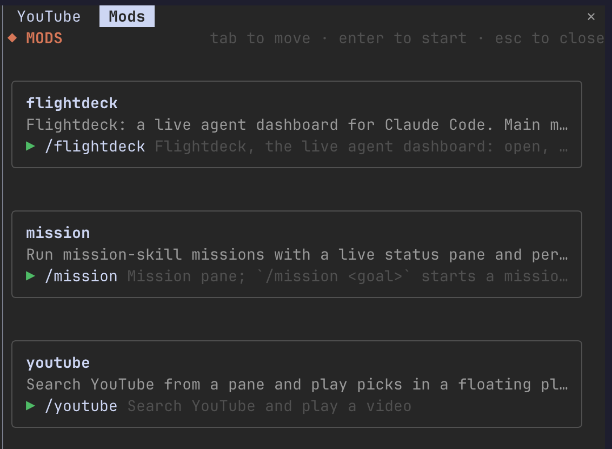

# Mods Menu for Claude Code

A **◆ mods** button in the lower-right corner of the Claude Code prompt footer. Click it to open a menu of every mod you have installed, then click one to start it.



## What it does

- **Footer button.** The **◆ mods** button sits at the right end of the prompt footer, after Claude Code's own mode labels. It shows in every session; the menu itself only opens when you click it.
- **`/mods`** opens the same menu from the prompt.
- **Every mod, from any marketplace.** The menu lists each installed plugin that loads a hooks module, which is what makes a plugin a mod. Mods you install later appear automatically.
- **One card per mod.** Each card shows the mod's name, its description and its slash commands. Click a command, or Tab to it and press Enter, to close the menu and run it.
- **Missing commands are visible.** A mod whose command isn't registered still gets a card, marked "no slash command to start it".

## Install

Clone the repo, then load it as a plugin folder:

```sh
git clone https://github.com/brogrammerMW/claude-mod-menu.git
claude --plugin-dir ./claude-mod-menu
```

To load it in every session, add the folder to a local plugin marketplace and install it with `claude plugin install`.

## Keys

| Key | Action |
| --- | --- |
| `Tab` | Move between commands |
| `Enter` | Start the selected mod |
| `Esc` | Close the menu |

## How it works

1. **Find the mods.** It reads Claude Code's list of installed plugins (`~/.claude/plugins/installed_plugins.json`) and keeps the ones whose `hooks/hooks.json` loads a module.
2. **Find their commands.** It asks Claude Code for every registered command and matches each one to a mod, by the plugin that added it or by name (`mod` or `mod:…`).
3. **Start a mod.** Clicking a command closes the menu, then runs the command as if you'd typed it.

The menu leaves itself out of the list.

## Known issue

If a mod's command is missing after `/reload-plugins`, start a new session. A fresh session registers every mod's commands at startup.

## Development

```sh
claude plugin validate .
claude plugin test .
```

The menu logic lives in `hooks/menu.ts` and is tested in `hooks/menu.test.ts`. The footer button and the menu pane live in `hooks/register.tsx`.
